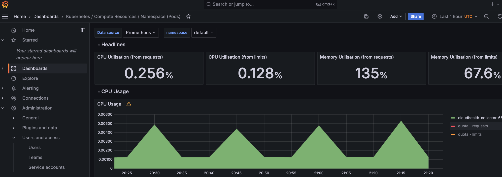

Grafana requires a dashboard provider and the actual dashboards to display. By default, a provider is created if enabled, but you can also mount your own provider using a ConfigMap. It’s important to note that the dashboard folder path must be `/opt/bitnami/grafana/dashboards`.

#### 1. Datasource Integration

To construct a dashboard, a datasource is essential. Datasources should be created by mounting a secret containing all datasource files. This is because datasources might include sensitive information, such as Prometheus credentials:

```
## Import datasources from an externally-managed secret, or define them via Helm values.

datasources:
  secretDefinition:
    apiVersion: 1
    datasources:
      - name: Prometheus
        type: prometheus
        url: https://prometheus-XXXX.XXXX.com/
        access: proxy
        isDefault: true

```

#### 2. Creating Your Own Dashboards

Follow these steps to create a dashboard in Grafana:

1. Log into the Grafana UI as an admin (refer to the [monitoring documentation](https://docs.vdp.vmware.com/docs/using_kubernetes/)).
2. Under the Dashboards icon in the side menu, click **New dashboard**.
3. On the dashboard, click **Add an empty panel**.
4. In the New dashboard/Edit panel view, select the data source from the data source selector—choose **Grafana** for a Random Walk dashboard.
5. Save the dashboard by clicking the save icon in the top-right corner, add a descriptive name, and then click **Save**.

For more detailed guidance, consult the official Grafana [documentation](https://grafana.com/docs/grafana/latest/getting_started/build-first-dashboard/).

**Export and Convert Dashboards:** It is highly recommended to export your dashboard and convert it into a `ConfigMap` to enable programmatic deployment alongside your application.

#### 3. Loading Dashboards

To deploy the dashboards, create a ConfigMap for each dashboard containing the JSON file that defines it. Here’s how to create dashboard ConfigMaps on your Kubernetes cluster:
```
kubectl create configmap my-dashboard-1 --from-file=my-dashboard-1.json
kubectl create configmap my-dashboard-2 --from-file=my-dashboard-2.json

```

Configure the `values.yaml` file to load these ConfigMaps during the Helm deployment:

```
dashboardsConfigMaps:
  - configMapName: kubelet-prod
    fileName: kubelet-prod.json
  - configMapName: cluster-total-prod
    fileName: cluster-total-prod.json
  - configMapName: namespace-by-pod-prod
    fileName: namespace-by-pod-prod.json
  - configMapName: pod-total-prod
    fileName: pod-total-prod.json
  - configMapName: k8s-resources-cluster-prod
    fileName: k8s-resources-cluster-prod.json
  - configMapName: k8s-resources-namespace-prod
    fileName: k8s-resources-namespace-prod.json
  - configMapName: k8s-resources-node-prod
    fileName: k8s-resources-node-prod.json
  - configMapName: k8s-resources-pod-prod
    fileName: k8s-resources-pod-prod.json

```

Upon completion, the configured dashboards will be available in the Grafana UI.



By following these steps, you ensure a smooth and secure deployment of Grafana dashboards that are essential for monitoring your Kubernetes environment.
