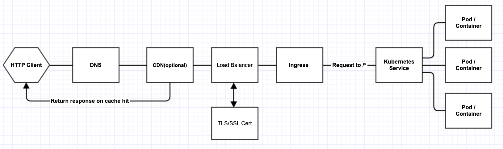

**Introduction:**

When SREs or Infrastructure Engineers set up, migrate, or update Kubernetes clusters, one critical aspect to consider is the networking traffic flow. The diagram provided illustrates a basic network traffic flow for exposing the Kubernetes API externally, incorporating various network components to enhance performance, security, and scalability. Depending on the cloud platform hosting the Kubernetes cluster, the selection of network components can vary to meet specific requirements. Advanced and complex configurations may also be introduced based on real needs. In this guide, I will delve into each component's details and provide examples to integrate these components effectively on both Google Cloud Platform (GCP) and Amazon Web Services (AWS).


## **1. DNS**

**Host Zone**: A DNS host zone is a portion of the DNS namespace that is managed by a specific organization or administrator. It encompasses all the DNS records for a particular domain and is essential for controlling domain routing.

**CNAME Record**: A Canonical Name (CNAME) record maps an alias name to a true or canonical domain name. CNAMEs are typically used to associate subdomains with existing DNS records, allowing a single IP address to serve multiple subdomains.

**A Record**: An Address Record (A Record) directly links a domain or subdomain to an IP address, specifying the IP address to which the domain should resolve. It is the most basic type of DNS record, used for converting domain names to corresponding IP addresses.

### **Integration Examples:**

**GCP: CloudDNS and ExternalDNS**

In Google Cloud Platform (GCP), CloudDNS manages domain names but does not automatically detect and configure DNS records based on Kubernetes deployments. This gap is filled by ExternalDNS, which monitors Ingresses, Services, and other Kubernetes resources to automatically manage DNS records. When an Ingress with a specified hostname is deployed, ExternalDNS detects this and creates the appropriate DNS records in CloudDNS, facilitating dynamic DNS record management as Kubernetes resources scale.

**AWS: Route 53**

Amazon Web Services (AWS) integrates Route 53 more closely with its Kubernetes services, such as Elastic Kubernetes Service (EKS). Using Route 53 in conjunction with AWS's Ingress controllers allows the hostnames specified in Ingress configurations to be automatically recognized and updated in Route 53 DNS records. This integration bypasses the need for an intermediary tool like ExternalDNS in most scenarios, streamlining the DNS management process.

## **2. CDN**

A Content Delivery Network (CDN) is vital for enhancing user experience on high-traffic and globally distributed applications. It achieves this by caching content at multiple geographically dispersed locations, which significantly reduces latency. Key scenarios where a CDN proves beneficial include:

- **Serving Static Content**: CDN efficiently delivers resources like images, CSS, and JavaScript closer to the user's location, speeding up page load times.
- **Managing Traffic Spikes**: During periods of high traffic, such as product launches or promotional events, a CDN can absorb the increased load, maintaining the stability and performance of the website.
- **Enhancing Security**: CDNs help mitigate Distributed Denial of Service (DDoS) attacks by distributing the load across its vast network of servers, often incorporating built-in security measures to identify and mitigate threats.
- **Cache Hit Optimization**: CDNs improve content availability and reduce bandwidth costs by serving cached content directly from the nearest edge server, thus optimizing resource usage and response times.

### Integration Examples

**AWS CloudFront with AWS Lambda**: Amazon CloudFront, integrated with AWS Lambda, offers a powerful combination that allows dynamic content customization close to the user's location. This setup enables executing code globally without managing servers, which enhances performance and reduces latency, also can be used for custom traffic redirection cases.

**GCP Cloud CDN**: Google Cloud's Cloud CDN leverages Google's globally distributed edge points of presence to accelerate content delivery for applications and websites. It is tightly integrated with Google Cloud services


## **3. Load Balancers**

### **Load Balancers on AWS:**

- **Network Load Balancer (NLB)**: Optimized for high-performance, low-latency TCP traffic. NLBs operate at the connection level (Layer 4), routing connections directly to instances using IP protocol data. They are ideal for handling millions of requests per second while maintaining ultra-low latencies, making them suitable for volatile workloads.

- **Application Load Balancer (ALB)**: Designed for advanced request routing at the application layer (Layer 7), ALBs route traffic to targets within Amazon EC2 instances, containers, IP addresses, and Lambda functions based on the content of the request, such as URL path or host field. This capability is particularly useful for modern application architectures, including microservices and container-based applications.

- **Classic Load Balancer (deprecated)**: Offers basic load balancing across multiple Amazon EC2 instances and operates at both the request level and connection level. It is being phased out in favor of more advanced and efficient load balancers like ALB and NLB.

### **Load Balancers on GCP:**

- **Global HTTP(S) Load Balancer**: A fully distributed, software-defined managed service, it is built on the same frontend serving infrastructure as Google. It provides cross-region load balancing, including automatic multi-region failover, which routes users to the closest healthy instance with the lowest latency. Ideal for HTTP and HTTPS traffic, it can scale to millions of queries per second.
 
- **TCP/UDP Proxy Load Balancer**: A global, external proxy load balancer that routes TCP and UDP traffic to backend VMs based on IP address, port, and protocol type. It is suitable for applications that do not need advanced traffic routing rules based on content.

- **Network Load Balancer**: Provides high-performance, scalable load balancing on a global scale by leveraging Google's global network. Unlike traditional network load balancers that route traffic based on incoming IP address and port, GCP’s Network Load Balancer is able to distribute external traffic among VM instances based on the geographical location of clients.

- **Internal Load Balancer**: Facilitates load balancing of traffic to internal Google Cloud VMs without exposing them to the public internet. It operates at the transport layer (Layer 4 - TCP/UDP) and is optimized for scenarios where you need to balance additional loads without external exposure.

## **4. TLS/SSL Certificate**

### **Step-by-Step Process to Generate a CSR:**

(1)**Generate a Private Key:**
```
openssl genpkey -algorithm RSA -out private.key
```

(2)**Create the CSR:**
```
openssl req -new -key private.key -out request.csr
```

When running this command, you’ll be prompted to enter details that will be included in your certificate request.
- **CSR Attributes:**
    
    - **Country (C)**: US
    - **State (ST)**: [Your State]
    - **Organization (O)**: Your Company Inc
    - **Organizational Unit (OU)**: Optional
    - **Common Name (CN)**: Server/application FQDN (e.g., `abc.example.com`)

    **Note on SAN (Subject Alternative Name):** Instead of using a wildcard certificate, it’s advisable to use a multi-domain certificate by adding SAN values. This can be specified during the CSR generation or added directly if your tooling or CA supports it.
    
(3)**Submit CSR to a Certificate Authority (CA)**: Copy the contents of the `request.csr` file and paste it into the appropriate form on your CA’s website to request your certificate.
 

### **Importing Certificates into Certificate Managers**

(1)**Google Certificate Manager:**

To import a certificate into Google Certificate Manager:

- Navigate to the Google Cloud Console.
- Go to Security -> Certificate Manager.
- Click on “Create Certificate.”
- Choose “Import” and upload your certificate file and private key. 

(2)**AWS Certificate Manager:**

To import a certificate into AWS Certificate Manager:

- Open the AWS Management Console.
- Go to Services -> Certificate Manager.
- Click on “Import a certificate.”
- Paste your certificate body, certificate private key, and certificate chain into the respective fields. 

## **5. Ingress**

### **Ingress configuration examples:**
(1)**Ingress using tls as a secret:**
```
apiVersion: networking.k8s.io/v1
kind: Ingress
metadata:
  name: my-ingress
spec:
  tls:
  - hosts:
    - "example.com"
    secretName: example-tls
  rules:
  - host: "example.com"
    http:
      paths:
      - pathType: Prefix
        path: "/"
        backend:
          service:
            name: my-service
            port:
              number: 80
```

(2)**Ingress on AWS with annotations:**
```
apiVersion: networking.k8s.io/v1
kind: Ingress
metadata:
  name: aws-ingress
  annotations:
    service.beta.kubernetes.io/aws-load-balancer-type: "nlb"  # Specifies using a Network Load Balancer
spec:
  tls:
  - hosts:
    - "aws.example.com"
    secretName: aws-example-tls
  rules:
  - host: "aws.example.com"
    http:
      paths:
      - pathType: Prefix
        path: "/"
        backend:
          service:
            name: my-service
            port:
              number: 80

```
**Key Annotations for AWS:**

- `service.beta.kubernetes.io/aws-load-balancer-type`: This annotation allows you to specify the type of load balancer to use. Common values include `nlb` for Network Load Balancer and `alb` for Application Load Balancer. This choice impacts how traffic is routed to your cluster and can be selected based on your specific performance and routing needs.
- `service.beta.kubernetes.io/aws-load-balancer-backend-protocol`: Indicates the protocol used by the backend (instance). Typical values are `http`, `https`, `ssl`, and `tcp`.
- `service.beta.kubernetes.io/aws-load-balancer-ssl-cert`: Needed if you want AWS to terminate SSL/TLS, not typically necessary if you are handling TLS termination at the ingress level.
More annotations for AWS, please go https://kubernetes-sigs.github.io/aws-load-balancer-controller/v2.3/guide/service/annotations/

(3)**Ingress on GCP with Annotation to Use Cert from Google Certificate Manager:**
```
apiVersion: networking.k8s.io/v1  
kind: Ingress  
metadata:  
  name: my-ingress  
  annotations:  
    networking.gke.io/managed-certificates: my-google-managed-cert  
spec:  
  rules:  
  - host: mydomain.com  
    http:  
      paths:  
      - path: /  
        pathType: Prefix  
        backend:  
          service:  
            name: my-service  
            port:  
              number: 80
```

## **6. kubernetes Service** 

### Comparing Service Types

**ClusterIP**: This is the default Kubernetes Service type. A ClusterIP service provides a service inside your Kubernetes cluster that other apps inside of the cluster can access. The service gets its own IP address that Pods within the cluster can use, but it's not accessible from outside the cluster unless additional routing mechanisms are set up.

**NodePort**: A NodePort service is the most primitive way to get external traffic directly to your service. NodePort opens a specific port on all Nodes (the VMs), and any traffic that is sent to this port is forwarded to the service.

**LoadBalancer**: This service type exposes the service externally using a cloud provider’s load balancer. The external load balancer routes traffic to the Kubernetes service, which in turn routes them to the Pods. This is the simplest way to expose a service outside the cluster but relies on the cloud provider’s infrastructure.

**ExternalName**: This service type maps a service to a DNS name, not typically to a selector such as my-service or my-pod. It’s used to point a Service to an external resource outside your cluster.

### Comparing Service Type: LoadBalancer vs. ClusterIP + Ingress + External Load Balancer

**LoadBalancer Service**:

- **Pros**:
    - Simple to set up; typically involves a single service configuration that the cloud provider automatically recognizes and provisions an external load balancer.
    - Direct integration with cloud providers' native load balancing, offering features like built-in health checks, SSL termination, and more.
- **Cons**:
    - Less control over traffic routing and load balancing rules compared to using an Ingress.
    - Can be more costly as each service of type LoadBalancer usually incurs a cost from the cloud provider.

**ClusterIP with Ingress and External Load Balancer**:

- **Pros**:
    - Greater flexibility and control over how traffic is routed to your services. You can define complex routing rules, SSL termination, and more at the Ingress level.
    - Potentially more cost-effective in environments where multiple services share the same Ingress.
    - Enhanced security configurations, like WAF integration, can be easier to implement at the Ingress level.
- **Cons**:
    - More complex to set up, requiring a correct configuration of Ingress resources and understanding of Ingress controllers.

## **7. Network Policy**

During the kubernetes traffic flow management, you can use networkpolicy to specify how groups of pods are allowed to communicate with each other and other network endpoints.

### How NetworkPolicies Work

When a `NetworkPolicy` is applied, it specifies a set of allowed traffic based on the following:

- **Pod Selectors**: Specify the pods to which the policy applies.
- **Namespace Selectors**: Restrict access based on the namespace labels.
- **IP Block**: Restrict access to and from other IP addresses.
- **Ports**: Specify the allowed ports that traffic can use.
- **Protocols**: Define allowed protocols such as TCP, UDP, or SCTP.

### Default Behaviors

- **Default Deny**: By default, pods are non-isolated; they accept traffic from any source. Pods become isolated by having a NetworkPolicy that selects them. Once isolated, pods reject any connections that are not allowed by any NetworkPolicy.
- **Policy Types**: Network policies include ingress, egress, or both types of traffic in their specifications.

### Example NetworkPolicy YAML Files

Here are some commonly used Kubernetes NetworkPolicy configurations:

#### (1)Deny All Traffic to a Pod

This policy denies all traffic to the pods in the `default` namespace with the label `role=backend`:
```
apiVersion: networking.k8s.io/v1
kind: NetworkPolicy
metadata:
  name: deny-all
  namespace: default
spec:
  podSelector:
    matchLabels:
      role: backend
  policyTypes:
  - Ingress
  - Egress

```
#### (2)Allow Traffic Only from Within the Same Namespace

This policy allows traffic only from pods within the same namespace that have the label `role=frontend`:
```
apiVersion: networking.k8s.io/v1
kind: NetworkPolicy
metadata:
  name: allow-same-namespace
  namespace: default
spec:
  podSelector:
    matchLabels:
      role: backend
  ingress:
  - from:
    - podSelector:
        matchLabels:
          role: frontend
```

#### (3)Allow Traffic on a Specific Port

This policy allows traffic to `role=backend` pods on TCP port 6379 from any pod within the same namespace:
```
apiVersion: networking.k8s.io/v1
kind: NetworkPolicy
metadata:
  name: allow-redis-port
  namespace: default
spec:
  podSelector:
    matchLabels:
      role: backend
  ingress:
  - ports:
    - protocol: TCP
      port: 6379

```

#### (4)Allow All Incoming Traffic from a Specific Namespace

This policy allows all incoming traffic to `role=backend` pods from any pod in a namespace labeled `user=frontend`:
```
apiVersion: networking.k8s.io/v1
kind: NetworkPolicy
metadata:
  name: allow-from-namespace
  namespace: default
spec:
  podSelector:
    matchLabels:
      role: backend
  ingress:
  - from:
    - namespaceSelector:
        matchLabels:
          user: frontend
```
#### (5)Allow Traffic from External Clients

This policy allows traffic from external clients by allowing traffic from specific IP ranges:
```
apiVersion: networking.k8s.io/v1
kind: NetworkPolicy
metadata:
  name: allow-external
  namespace: default
spec:
  podSelector:
    matchLabels:
      role: backend
  ingress:
  - from:
    - ipBlock:
        cidr: 192.168.1.0/24
        except:
        - 192.168.1.5/32
```
More details can be found at: https://kubernetes.io/docs/concepts/services-networking/network-policies/