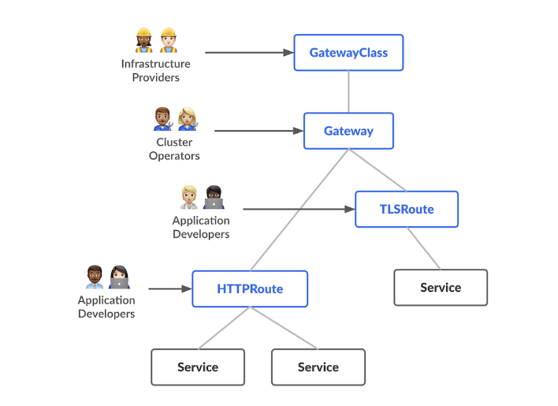

Before we delve into the specifics of Service Mesh and Gateway API, it's important to consider the following three questions. Understanding these will clarify why integrating Service Mesh with Gateway API is considered an advanced method for exposing Kubernetes APIs externally.
## What's the difference between Gateway API and an API Gateway?[¶](https://gateway-api.sigs.k8s.io/#whats-the-difference-between-gateway-api-and-an-api-gateway "Permanent link")

An API Gateway is a general concept that describes anything that exposes capabilities of a backend service, while providing extra capabilities for traffic routing and manipulation, such as load balancing, request and response transformation, and sometimes more advanced features like authentication and authorization, rate limiting, and circuit breaking.

Gateway API is an interface, or set of resources, that model service networking in Kubernetes. One of the main resources is a `Gateway`, which declares the Gateway type (or class) to instantiate and its configuration. As a Gateway Provider, you can implement Gateway API to model Kubernetes service networking in an expressive, extensible, and role-oriented way.

Most Gateway API implementations are API Gateways to some extent, but not all API Gateways are Gateway API implementations.

## What's the relationship between service mesh and Gateway API?

Gateway API was originally designed to manage traffic from clients outside the cluster to services inside the cluster -- the _ingress_ or [_north/south_](https://gateway-api.sigs.k8s.io/concepts/glossary#northsouth-traffic) case. Over time, though, interest from [service mesh](https://gateway-api.sigs.k8s.io/concepts/glossary#service-mesh) users prompted the creation of the GAMMA (**G**ateway **A**PI for **M**esh **M**anagement and **A**dministration) initiative in 2022 to define how Gateway API could also be used for inter-service or [_east/west_ traffic](https://gateway-api.sigs.k8s.io/concepts/glossary#eastwest-traffic) within the same cluster.

The service mesh and Gateway API can be complementary:

1. **Layer of Operation**: While the service mesh operates primarily inside the cluster, handling east-west traffic (traffic moving within the cluster), the Gateway API is often used to manage north-south traffic (traffic entering and leaving the cluster).
    
2. **Scope of Management**: The service mesh provides a broad set of capabilities aimed at managing communications and resilience between microservices. The Gateway API, however, focuses on the ingress and potentially egress points of the cluster, helping to define how external traffic should be routed to services inside the cluster.
    
3. **Operational Integration**: In a Kubernetes environment using both a service mesh and the Gateway API, the service mesh can manage internal service interactions and ensure they are secure and reliable, while the Gateway API can manage how external requests are routed to those internal services. This setup can provide a robust framework for both internal service reliability and external traffic management.
    
4. **Complementary Benefits**: By using both, organizations can ensure that their internal microservices are well-managed and resilient (via the service mesh) while also providing flexible, powerful, and administratively simple external traffic routing (via the Gateway API).

### What are the benefits of integrating Service Mesh with Gateway API compared to the basic traffic flow of a Load Balancer with Ingress?

Integrating a service mesh with the Gateway API provides several key advantages over traditional load balancer and ingress setups:

1. **Enhanced Traffic Control**: Service mesh offers fine-grained traffic management capabilities like canary deployments, traffic splitting, and detailed routing rules, which go beyond the capabilities of standard ingress controllers.
    
2. **Improved Security Features**: Service meshes typically provide strong security features, including end-to-end encryption within the cluster (mTLS), automatic rotation of security certificates, and sophisticated access control policies that integrate seamlessly with Gateway API’s ingress management.
    
3. **Better Observability**: Service meshes excel in providing deep observability into metrics, logs, and traces across services, which is crucial for diagnosing issues in microservices architectures. This is complemented by the Gateway API's structured approach to managing ingress traffic.
    
4. **Operational Simplicity**: While individual components like load balancers and ingress controllers can manage basic traffic routing effectively, the combination of a service mesh with Gateway API offers a unified approach to traffic governance that simplifies operational requirements and reduces overhead.

## 1. Gateway API:

The Gateway API is a Kubernetes-specific set of APIs that focuses on managing external access to the services within a Kubernetes cluster. The Gateway API provides more granular and extensible routing capabilities than the older Kubernetes Ingress API. Key features include:

- **Advanced Routing**: Configuring more complex routing schemes like header-based routing, weighted traffic splitting, and more.
- **Cross-Namespace References**: Allowing a single Gateway to route traffic to services across different namespaces, managed by different administrative boundaries.
- **Multi-Gateway Configurations**: Supporting multiple types of gateways (e.g., for different environments like development and production)
  
More details can be found at: https://gateway-api.sigs.k8s.io/

Below are several renowned Gateway API controllers you might consider:

- **Istio**
   - Istio is primarily known as a service mesh but also includes capabilities to act as a Gateway API controller. It can manage, observe, and secure microservices communications, but also works well with Gateway API resources to handle ingress and potentially egress traffic for Kubernetes clusters.

- **Kong**
  - Kong Gateway can operate as a Gateway API controller, leveraging its robust API management features. Kong provides plugins and features that manage traffic, security, and monitoring, aligning well with the Gateway API’s goal of more expressive routing capabilities.

- **Contour**
 - Contour is an open-source Kubernetes ingress controller using Envoy proxy. It is one of the early adopters of the Gateway API, providing full support for its resources. Contour focuses on easy configuration, raw HTTP and HTTPS routing, and was developed with an emphasis on simplicity and clarity.

- **Traefik**
 - Traefik is a popular cloud-native ingress controller known for its simplicity and configurability. It also supports the Gateway API, allowing users to benefit from Traefik's dynamic configuration capabilities and extensive middleware support while leveraging the standardization offered by the Gateway API.

- **Gloo**
 - Gloo Edge, developed by Solo.io, is an API gateway and ingress controller built on Envoy Proxy. It supports the Gateway API and is designed for high-performance environments. Gloo integrates well with both traditional VM-based applications and newer Kubernetes-based applications.

- **Ambassador**
 - Ambassador API Gateway is another Envoy-based ingress controller that supports the Gateway API. It is particularly well-suited for microservices architectures and provides extensive features around traffic management, security, and observability.

## 2. Service Mesh 
A service mesh is an infrastructure layer that allows you to manage communication between microservices. It handles things like routing, load balancing, and service discovery, and can provide features like observability, security, and resiliency. This is typically implemented with a set of network proxies that sit next to application pods and implement the necessary headers/routing/traces/global DNS/etc - all without changes to application code.
The core functionalities of a service mesh typically include:

- **Service Discovery**: Automatically detecting services within the system as they are added or removed.
- **Load Balancing**: Efficiently distributing network traffic among multiple instances of a service.
- **Fault Tolerance**: Managing failures gracefully, with support for retries, failover, circuit breakers, and rate limiting.
- **Security**: Providing robust security features, including strong identity-based authentication and authorization between services.
- **Observability**: Offering detailed insights into dependencies and the health of services through logging, tracing, and monitoring.
  
As Istio is primarily known as a service mesh but also includes capabilities to act as a Gateway API controller, which will be introduced more in the next section. There are several renowned open-source service mesh solutions besides Istio.

- **Linkerd**:
    
    - Linkerd is one of the oldest service meshes and is part of the Cloud Native Computing Foundation (CNCF), like Istio. It's known for its simplicity and low resource overhead. Linkerd provides fundamental service mesh features like service discovery, load balancing, failure recovery, and observability. It's built on top of the lightweight and performant Rust programming language, which ensures minimal performance overhead.
- **Consul Connect**:
    
    - Developed by HashiCorp, Consul is primarily a service discovery tool but also offers service mesh capabilities through Consul Connect. It provides service-to-service connection authorization and encryption, traffic routing, and observability. Consul is notable for its ability to work across multiple data centers and its seamless integration with HashiCorp’s other tools like Terraform and Vault.
- **Envoy**:
    
    - While Envoy itself is often considered just a proxy, it forms the backbone of several other service mesh implementations, including Istio. Developed by Lyft, Envoy can be used as a standalone service mesh when combined with other tools for configuration and management. It excels in handling service-to-service communication, load balancing, and network resilience.
- **Kuma**:
    
    - Created by Kong Inc., Kuma is a relatively newer service mesh that is built on top of Envoy. It is designed to be more straightforward to use than some other service meshes and is aimed at providing out-of-the-box service mesh capabilities with minimal configuration. Kuma supports multi-cluster, multi-tenant, and multi-region deployments, making it suitable for large-scale environments.
- **Open Service Mesh (OSM)**:
    
    - Open Service Mesh is a lightweight, extensible, cloud-native service mesh that runs on Kubernetes and is designed for simplicity and ease of use. It implements the Service Mesh Interface (SMI), which provides standard, interoperable APIs for common service mesh capabilities.

## 3. Istio:

**Istio** is an open-source service mesh that integrates seamlessly with existing distributed applications. As one of the most popular service mesh implementations, Istio facilitates the management of complex microservices deployments in a transparent and platform-independent manner. Although it supports multiple orchestration environments, Istio is predominantly used with Kubernetes.

### Key Features

- **Sidecar Injection**: Istio employs a sidecar model within Kubernetes. Microservices can opt-in to the service mesh through annotations on their workloads, triggering a MutatingWebhook that injects the Istio sidecar (an Envoy proxy). This proxy intercepts all network traffic, allowing for dynamic configuration management. Learn more about Istio's sidecar injection [here](https://istio.io/latest/docs/reference/config/networking/sidecar/).
    
- **Mutual TLS (mTLS)**: Istio excels in configuring and managing mTLS for secure communication between microservices. It handles encryption/decryption and certificate lifecycle management transparently, alleviating the need for code-level changes by developers. Detailed information on mTLS is available [here](https://istio.io/latest/docs/concepts/security/#mutual-tls-authentication).
    
- **Istio Ingress Gateway**: Similar to traditional ingress controllers, the Istio Ingress Gateway facilitates entry of traffic into the cluster, tightly integrating with Istio's configuration capabilities and supporting mTLS. More about Istio Ingress Gateway can be found [here](https://istio.io/latest/docs/tasks/traffic-management/ingress/ingress-control/).

### Advanced Traffic Management

Istio provides sophisticated tools to control traffic flow within a service mesh:

- **Virtual Services**: These define the routing of traffic to specific services, allowing for complex rules such as header-based, path-based routing, retries, and weighted routing. Virtual Services specify the behavior of traffic and integrate seamlessly with Destination Rules for nuanced traffic management. Learn more about Virtual Services [here](https://istio.io/latest/docs/reference/config/networking/virtual-service/).
    
- **Destination Rules**: Post-routing, Destination Rules apply to traffic at its final destination, configuring load balancing, connection pooling, and fault injection. These rules are crucial for fine-tuning service behavior and resilience. More details on Destination Rules can be found [here](https://istio.io/latest/docs/reference/config/networking/destination-rule/).
    

### Best Practices

Istio's capabilities extend across various domains, each with dedicated best practices:

- **Traffic Management**: [Best practices for managing traffic](https://istio.io/latest/docs/ops/best-practices/traffic-management/) help optimize routing and load balancing.
- **Deployment**:  [Deployment Best Practices](https://istio.io/latest/docs/ops/best-practices/deployment/),general best practices when setting up an Istio service mesh.
- **Security**: [Security best practices](https://istio.io/latest/docs/ops/best-practices/security/) enhance the protection of microservices within the mesh.
- **Observability**: For monitoring and logging, follow [observability best practices](https://istio.io/latest/docs/ops/best-practices/observability/).